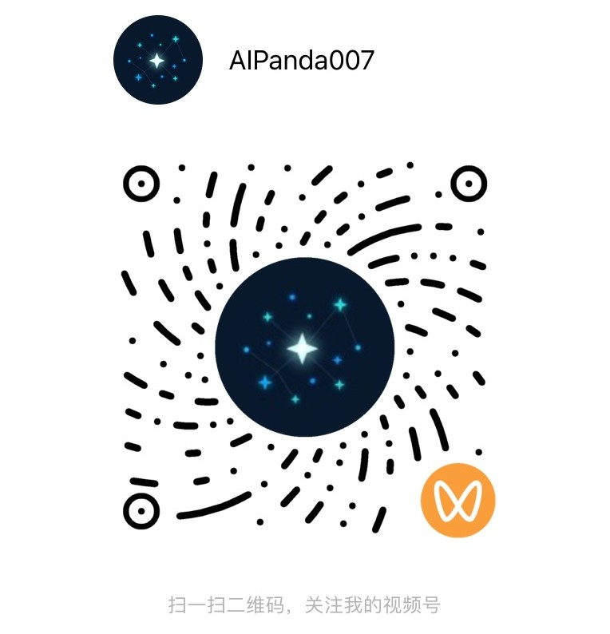

<strong>中文</strong> | <a href="README_EN.md">English</a>

# 👋 你好，我是潘姣（Joyce Pan）

### 🤖 数据智能 | 工业AI | AIGC

   

---

## 🚀 关于我

- ✨ **专注方向：设计Data+AI产品，交付数智化转型解决方案**
- 🏷️ **关键词**：数据智能 | 工业AI｜B2B售前数据分析经验｜制造业产品研发经验
- 💼 **曾就职于**：[SAS](https://www.sas.com/en_hk/home.html) 数据分析顾问 - [JMP统计分析软件](https://www.jmp.com/zh-hans/home)
- 🔬 **主要研究领域**：数据科学、机器学习、深度学习、计算机视觉、大语言模型、RAG、AI Agent、ChatBI、AIGC
- 🎬 **个人兴趣**：AIGC原创短片全流程制作
- 🌐 **英语水平**：流利口语，雅思7.5
- 💡 **合作**：求职中，找我上班/项目合作请联系
- 📫 **邮箱**：[panjiao007@126.com](mailto:panjiao007@126.com)
- 🏠 **个人主页**：[joyce.hitai.space](https://joyce.hitai.space/)（Data + AI 作品集）
- 📍 **所在地**：中国 北京

---

## 🛠️ 技术栈

### 📊 编程与数据科学

         

### 🤖 AI与大模型

                   

### 📋 项目管理

   

### 📐 六西格玛

   

---

## 🎓 认证证书

     

**证书列表：**

- 🏅 **[PMP](https://www.credly.com/badges/a758c464-6935-4adc-9cf2-d5785520fc5e)**（PMI认证）
- 🏅 **[ACP - 大模型](https://www.linkedin.com/in/joyce-pan-549596138/details/certifications/)**（阿里云认证）
- 🏅 **[深度学习架构师](https://www.linkedin.com/in/joyce-pan-549596138/details/certifications/)**（工信部人才交流中心认证）
- 🏅 **[大模型应用开发工程师](https://www.linkedin.com/in/joyce-pan-549596138/details/certifications/)**（工信部人才交流中心认证）
- 🏅 **[统计思维与问题解决](https://www.credly.com/badges/18d44ede-7045-4a93-b156-48b435f325f9/public_url)**（SAS认证）
- 🏅 **[探索性数据分析](https://www.credly.com/badges/60dde99a-3fc5-4823-b207-098da667ed2a/public_url)**（SAS认证）
- 🏅 **[质量方法](https://www.credly.com/badges/d2f98c3c-4910-4243-9771-40139310ae99/public_url)**（SAS认证）
- 🏅 **[Python数据科学、AI与开发](https://www.coursera.org/account/accomplishments/verify/K5E5ST5SYFCW)**（IBM / Coursera认证）
- 🏅 **[SQL（中级）](https://www.hackerrank.com/certificates/5a483dd934b9)**（HackerRank认证）
- 🏅 **[商务英语沟通技能](https://www.coursera.org/account/accomplishments/specialization/VA23KNUCMFJU)**（Coursera认证）

---

## 🌟 精选项目

### 🤖 AI项目

#### [城市角落的光 | Light Everywhere | AI原创音乐MV | AIGC原创动画短片](https://www.youtube.com/watch?v=OMIchR2C6qs)

- 独立完成词曲和MV创作全流程，包括：创作歌词、润色歌词、生成歌曲、设计故事、构造角色、设计场景、生成分镜、编写提示词、生成视频、合成视频、加入歌词字幕、内容发布和运营
- **技术栈**：MiniMax Music-2.6、Seedance 2.0 Fast、AIGC、AI音乐生成、AI视频生成
- **视频**：[YouTube](https://www.youtube.com/watch?v=OMIchR2C6qs) | [Bilibili](https://www.bilibili.com/video/BV1pyofB2Ebe/)

#### [ChatBI OEE · 智能制造对话式BI](https://github.com/sharp-007/ChatBI_OEE)

- 智能制造OEE分析平台，融合传统BI看板与基于NL2SQL的AI对话式分析
- **技术栈**：FastAPI、Streamlit、Qwen（DashScope）、MySQL、NL2SQL、SQLAlchemy、Plotly
- **视频演示**：[AI-Native ChatBI Is All You Need](https://www.youtube.com/watch?v=uN0ACWdIo_w)

#### [Dify Agents · Dify智能体合集](https://github.com/sharp-007/Dify_Agents)

- 基于Dify构建的AI Agent合集，包括RAG统计分析助手（STIPS课程）和豆包TTS工作流
- **技术栈**：Dify、Qwen、豆包TTS、RAG、LLM、AI Agent
- **在线体验**：[JMP统计课程助手](https://udify.app/chat/XT3989ncVdT34kF1) | [TTS工作流](https://udify.app/workflow/x6pbDMMEEo3okRxY)
- **视频演示**：[YouTube - RAG助手](https://youtu.be/cIeVL_LVJzc?si=qagvOE6xGm_SHyBI) | [YouTube - TTS工作流](https://www.youtube.com/watch?v=cAyfcVhefHw)

#### [碳纤维缺陷检测系统](https://github.com/sharp-007/carbon_fiber_defect_detection_system_pyhton3.10)

- 基于深度学习的制造业质量控制缺陷检测系统
- **技术栈**：Python、PyTorch、OpenCV、YOLO、Streamlit、计算机视觉
- **在线体验**：[Streamlit App](https://carbon-fiber-defect-detection-system.streamlit.app/)
- **视频演示**：[YouTube](https://youtu.be/EXzDLKLUBks?si=uWNxISJZhz_-_Gka)

#### [RAG工业知识问答智能体](https://github.com/sharp-007/industrial_agent_mini_demo)

- 基于RAG的工业智能体Demo，支持PDF文档处理与语义检索
- **技术栈**：React、FastAPI、LangChain、ChromaDB、Qwen、LLM、RAG

#### [AssetOpsBench资产运维迷你智能体](https://github.com/sharp-007/mini_demo_with_AssetOpsBench)

- 基于[AssetOpsBench](https://github.com/IBM/AssetOpsBench)的资产管理运维AI Agent Demo
- **技术栈**：React、Python、LLM、AI Agent

#### [Kaggle猫狗分类 - PyTorch](https://github.com/sharp-007/Kaggle_Dogs_vs_Cats_PyTorch)

- 基于PyTorch的图像分类项目
- **技术栈**：PyTorch、深度学习、迁移学习

### 📊 数据科学项目

#### [河西走廊丝绸之路之旅](https://github.com/sharp-007/Hexi-Corridor-Silk-Road)

- 数据驱动的丝绸之路之旅，结合JMP交互式数据可视化与旅行叙事，涵盖地理、历史、文化和气候
- **技术栈**：JMP、图形生成器、数据可视化、交互式报告
- **视频**：[YouTube](https://www.youtube.com/watch?v=bP5fksosc08)

#### [基于随机森林的电弧问题解决方案](https://github.com/sharp-007/Arcing-Issue-Solution-with-Random-Forest)

- 基于随机森林的制造业质量问题分析
- **技术栈**：Python、随机森林、统计分析、JMP

#### [数字识别](https://github.com/sharp-007/Digit-Recognizer)

- 手写数字识别项目
- **技术栈**：Python、机器学习、数据科学

### 🎓 公开课程

#### [DOE入门课：从方法到实践，60分钟轻松掌握DOE](https://www.jmp.com/zh-hans/resources/on-demand/local/jmp-doe-from-zero-on-demand)

- DOE基础入门课程，涵盖应用场景、操作流程、经典案例与定制设计实战
- **主题**：DOE、响应面设计、定制设计、JMP

#### [DOE经典案例实战：产品研发与工艺优化的3种实验设计方法](https://www.jmp.com/zh-hans/resources/on-demand/local/doe-industry-cases-study)

- 3大行业领域DOE应用实例，对比经典、最优与现代实验设计方法
- **主题**：DOE、混料设计、空间填充设计、机器学习、SVEM

#### [从0到1掌握DOE：为工程师定制的零基础DOE手册](https://www.jmp.com/zh-hans/resources/white-papers/doe-from-zero-for-engineers)

- DOE核心知识与案例解析白皮书，帮助工程师从零基础快速掌握DOE
- **主题**：DOE、定制设计、白皮书

#### [45分钟完全入门质量分析：2大案例讲透质量工程师80%的数据分析场景](https://www.jmp.com/zh-hans/resources/on-demand/local/get-started-quality-engineer)

- 通过SPC过程能力分析与六西格玛良率提升2大案例，覆盖质量工程师核心分析场景
- **主题**：质量分析、SPC、MSA、DOE、六西格玛、JMP

### 📄 论文与专利

#### [碳纳米管薄膜与超薄碳纤维预浸料复合材料的混杂效应](https://journals.sagepub.com/doi/10.1177/0731684416684020)

- 潘姣, 李敏, 王绍凯, 顾轶卓, 李清文, 张佐光
- **期刊**：Journal of Reinforced Plastics and Composites, 2016
- **主题**：碳纳米管薄膜、碳纤维、混杂复合材料、力学性能、阻尼、电导率

#### [导电织物及其制备方法和应用 (CN110106474B)](https://patents.google.com/patent/CN110106474B/en)

- 发明专利（中国）— 徐韬, 徐烨烽, 潘姣
- **专利号**：CN110106474B，2021年授权
- **主题**：导电织物、电磁性能

---

## 📫 联系我

   

---

## 🤝 合作

欢迎 **Data+AI** / **Industrial AI** 项目合作；欢迎 **Vibe Coding** 项目合作与案例展示；欢迎 **AIGC短片制作** 项目合作。

 

| 微信公众号 · 失控的智能 | 微信视频号 · AIPanda007 |
|:---:|:---:|
|  |  |

